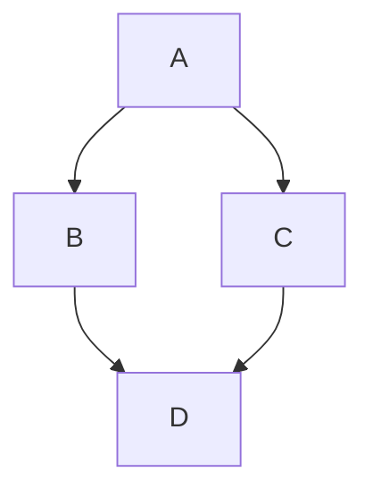

# Mermaid diagram
<figure id="Mermaidvoorbeeld" alt="Mermaid voorbeeld graph">

<figcaption>Mermaid voorbeeld</figcaption>
</figure>

<!-- .mermaid files in media subdir. Needs mermaid plugin/generateMermaidFigures, not enabled.
<figure id="mermaidvoorbeeld2">
    

    <figcaption>Voorbeeld mermaid graph</figcaption>
</figure> -->
